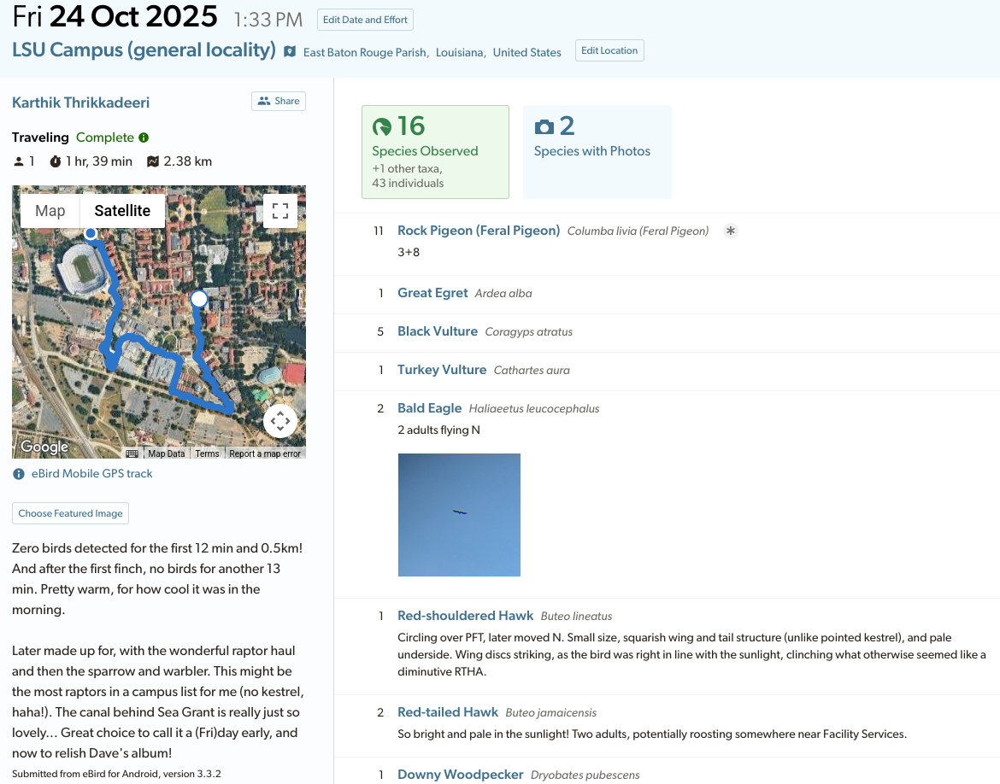
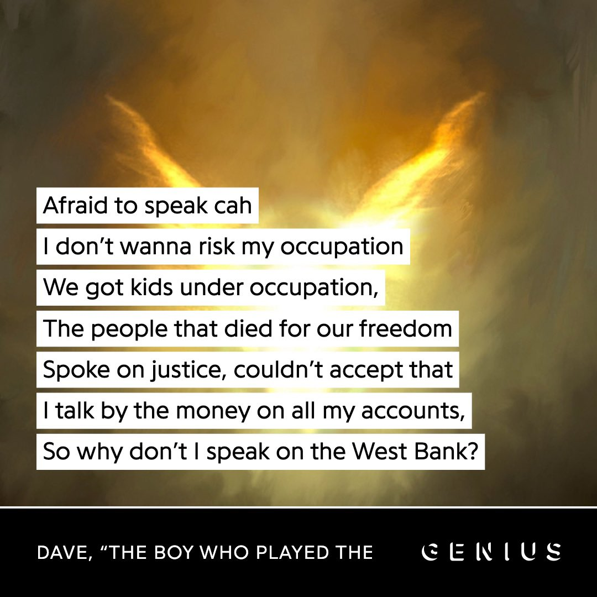
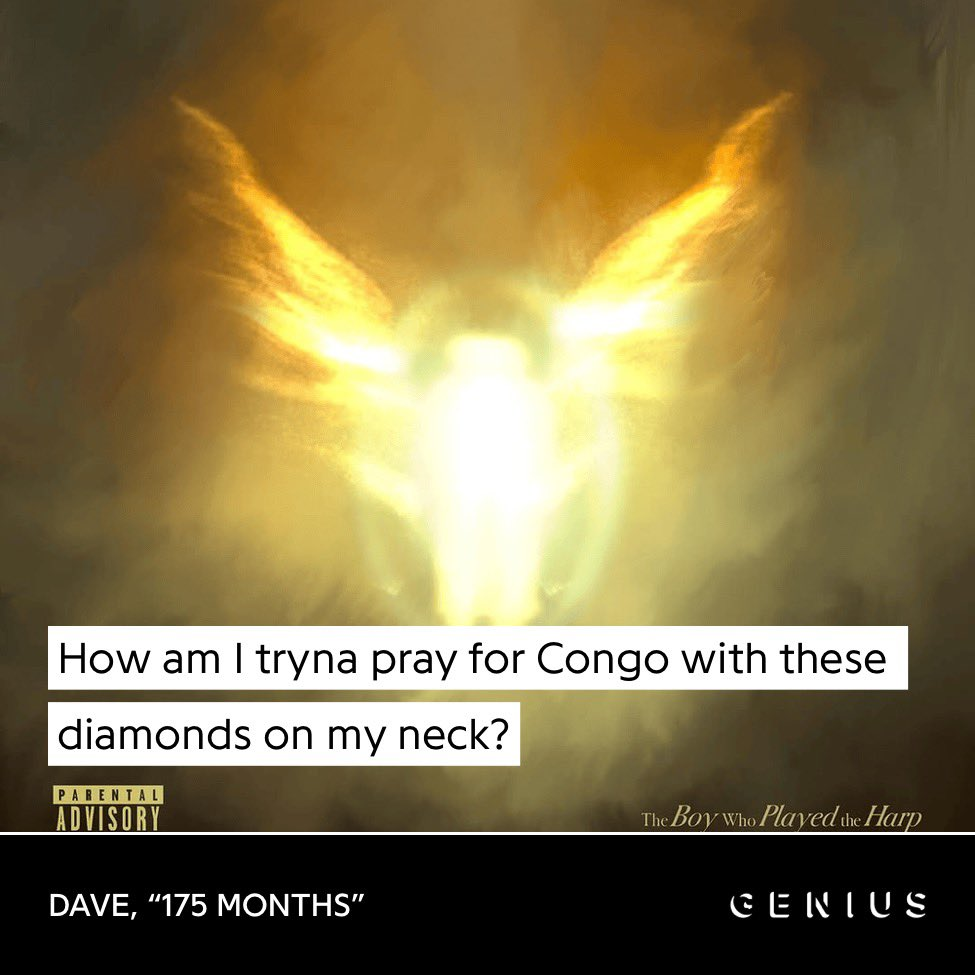
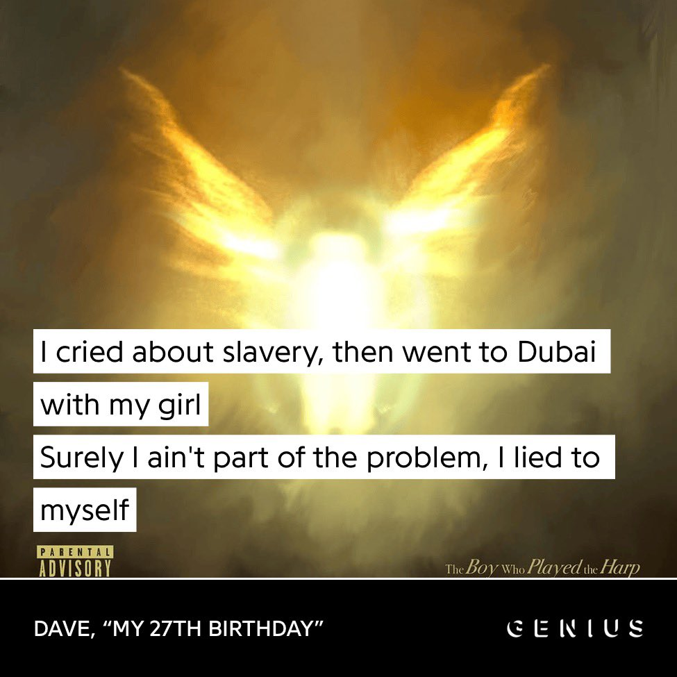
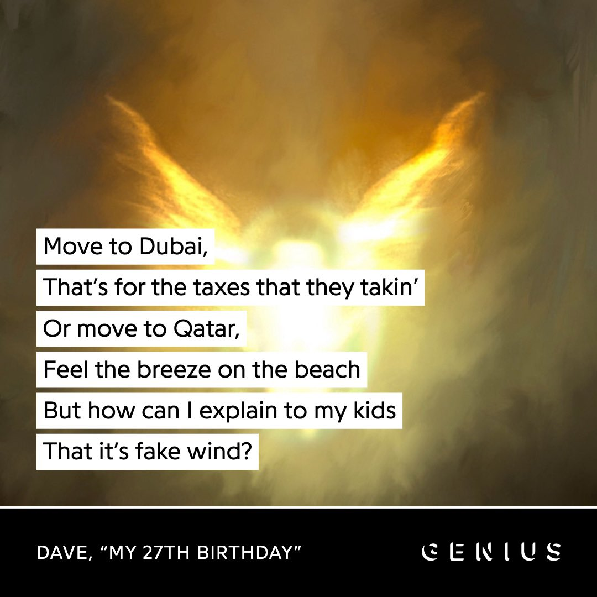
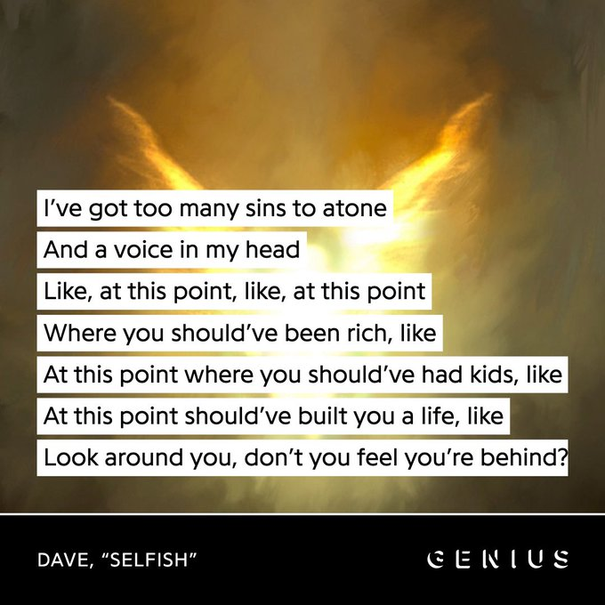
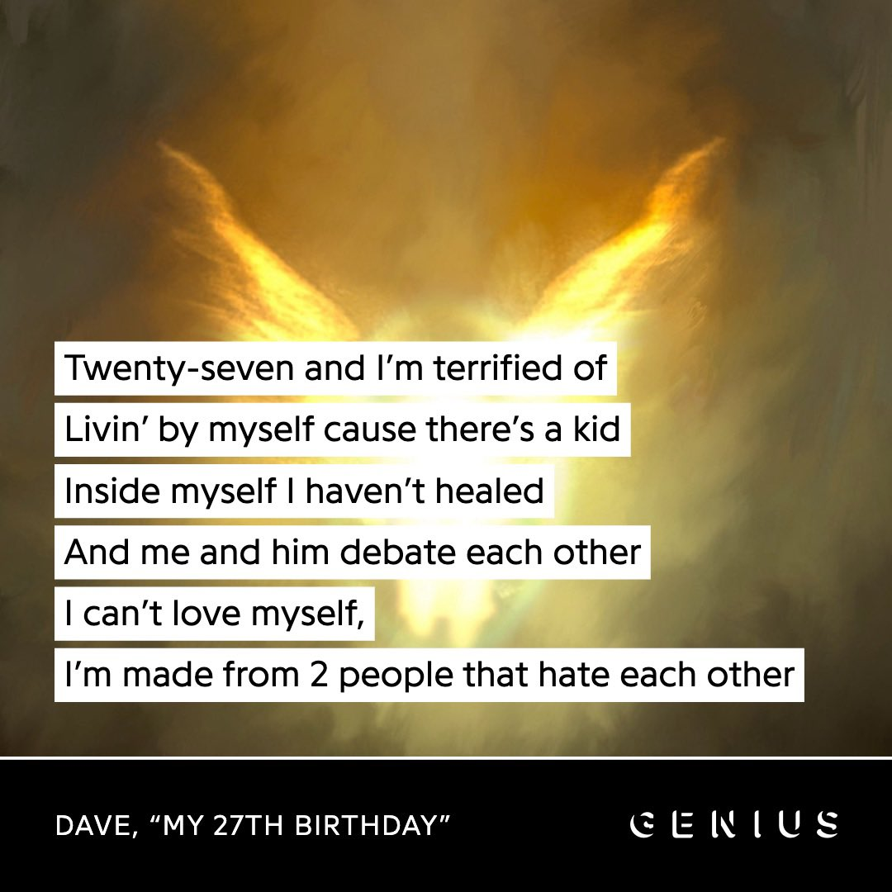
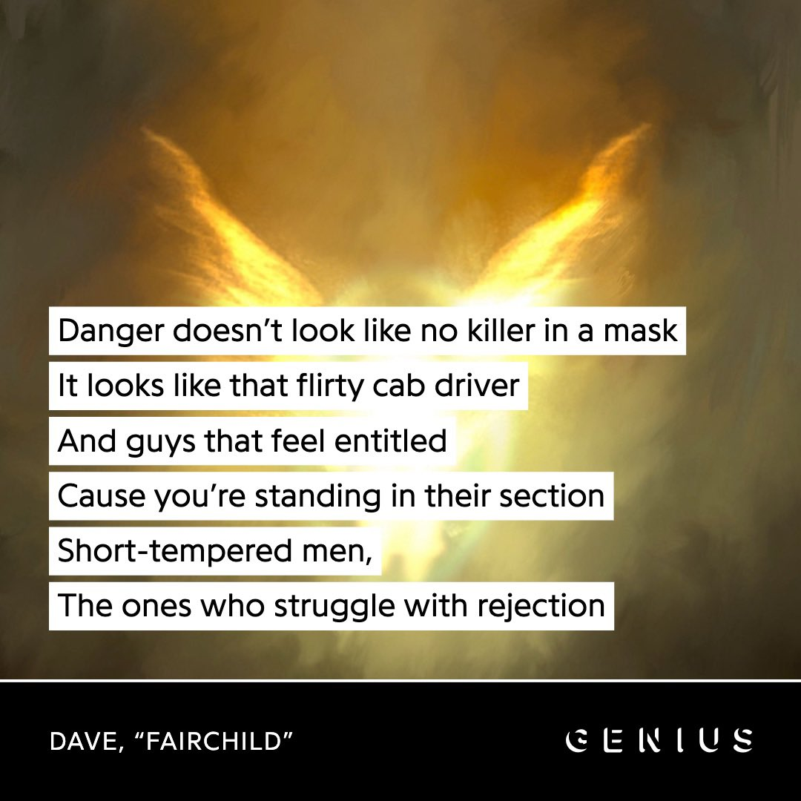
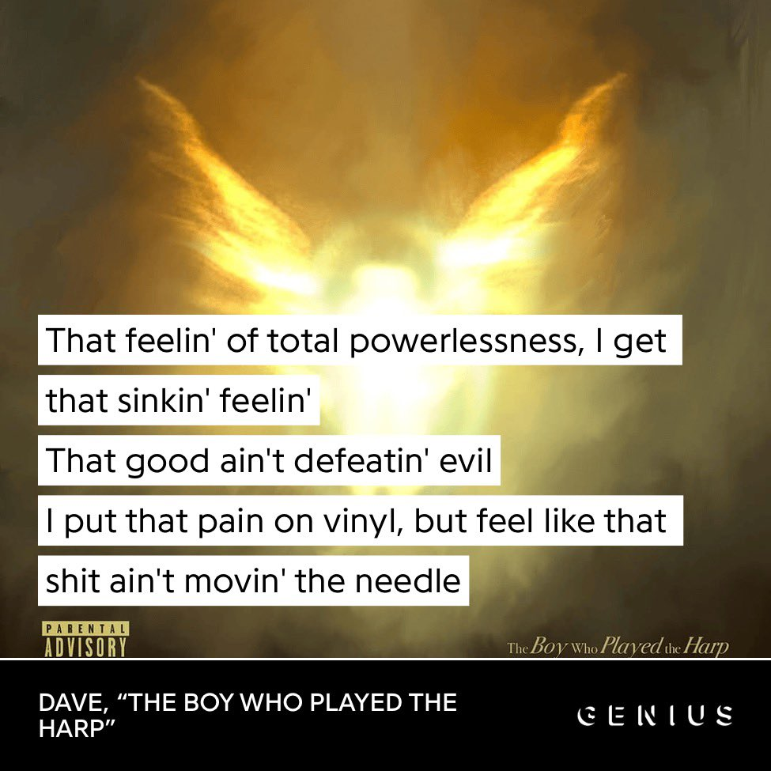

Dear Friend,

In this letter I try to press sense out of a specific set of jumbled thoughts and emotions, with many others being left out. Healthy corporate prioritization! Right now I am in a weird in-between period of a few weeks with not much keeping me urgently busy, and I just wanted to write. I usually do not rest easy until and unless my thoughts, and by extension my writing, follow a clear discernible logic, so this is a personal challenge as well as an amusing creative experiment.

(Did you notice the "z"? With much of my life now revolving around American systems, I find myself having to make the correction too often, so I wonder whether it's better to simply give in and allow myself the change for this while.)

The FIFA World Cup is underway and I wound up going some ways down memory lane, to a time more than a decade ago, when I used to actively follow football and even engage in obnoxious public declarations of my Chelsea devotion on Golden-Age Twitter. Back when one unassuming Belgian was a global phenom, and the star in every Chelsea fan's eyes. 

It's so interesting how things that were such big parts of your life at one point can so quietly vanish into your mind's backrooms as time passes. I had phased out of football towards the end of my school years, long before Eden Hazard left Chelsea for Real Madrid. I now realize he had a sad four years there, ridden with injuries and haunted by old glory that struggled to keep up, until he eventually retired at an early age of 32. Naturally curious about his own perspective on everything, I found [this interview by The Guardian](https://www.theguardian.com/football/2026/feb/15/eden-hazard-im-more-of-a-taxi-driver-than-a-football-player-now-but-its-ok) from earlier this year. My immediate reaction was, "of course, that makes so much sense! That is so Hazard." My next train of thought followed the many bits of his perspective that resonated deeply with me. 

For a while now, even before being a couple years into my PhD, I have been thinking about what I want to be doing at the Endgame. About how I can't see myself sticking to the academic rat race for too long. Hell, to any conventional working life. Wondering how unrealistic my vague vision truly is. Questions of practicality aside, these thoughts also implicate matters of philosophy. If I don't see myself working forever, what will I be doing instead? What will keep me accountable to indeed do anything at all? To prove my existence meaningful? When do I even want the Endgame to start? And, in wistful nostalgia more than anything, what will become of everything that I had built towards: my skills, knowledge and experience? Won't I be throwing all that to waste? Do I not owe it to everyone to make use of it all for some greater purpose?

Unlike many other young sensations eternally plagued by their immense early talent, Hazard genuinely seems to be at peace now with his slow-paced, simple life. He always loved simplicity. All through his career, he embodied the sentiment of enjoying the process and not getting lost in the race of it all. His infamous aversion to the strict training regimes of a pro-footballer's life is an easy example. From the very start, he was there to enjoy himself, doing what he enjoyed the most. Now, his tier list has simply been reorganized, with football no longer occupying S Tier. 

> Now my life is quite simple. I'm a dad of five. In this moment, I'm more of a taxi driver than a football player, but it's OK.

It strikes me that his almost stoic outlook is what freed him of the burden of the very brilliance that defined that first chapter of his life, football. He doesn't consider that brilliance to have been "lost" or "wasted" now that the pages have turned. He is simply content that it happened, preferring to be remembered "just as a good player and a good, funny guy". He doesn't need anything more than that. To me, his attitude is very impressive and enviable. His Meaning circumscribes a simple future with his family, which is so refreshing in this age characterized by chasing after more. 

His story reminded me of the Turkish farmer from whom Candide gained many fruits, both literal and figurative: 

> Pangloss, who was as inquisitive as he was argumentative, asked the old man what the name of the strangled Mufti was. 'I don't know,' answered the worthy man, 'and I have never known the name of any Mufti, nor of any Vizier. I have no idea what you're talking about; my general view is that people who meddle with politics usually meet a miserable end, and indeed they deserve to. I never bother with what is going on in Constantinople; I only worry about sending the fruits of the garden which I cultivate off to be sold there.' Having said these words, he invited the strangers into his house; his two sons and two daughters presented them with several sorts of sherbet, which they had made themselves, with kaimak enriched with the candied-peel of citrons, with oranges, lemons, pine-apples, pistachio-nuts, and Mocha coffee…---after which the two daughters of the honest Muslim perfumed the strangers' beards. 'You must have a vast and magnificent estate,' said Candide to the turk. 'I have only twenty acres,' replied the old man; 'I and my children cultivate them; and our labour preserves us from three great evils: weariness, vice, and want.' Candide, on his way home, reflected deeply on what the old man had said. 'This honest Turk,' he said to Pangloss and Martin, 'seems to be in a far better place than kings…. I also know," said Candide, "that we must cultivate our garden.'
> 
> --- Voltaire, "Candide"

Indeed, Hazard is almost exactly a modern incarnation of The Turk: part of his attention nowadays is drawn to vineyards in southern Italy producing signature Pinot Grigio bottles with his name on them. (Read more about the enchanting ideas offered by Voltaire in "Candide" over [at the School of Life](https://www.theschooloflife.com/article/cultivate-own-garden-voltaire/).)

In my mind, the story of Eden Hazard is intimately linked to another recent parasocial sojourn of mine, one that offered similar philosophical solace. For the longest time, I didn't have an easy answer to the question of my favorite music artist. It seemed like a question too complex for a parsimonious answer, "favorite" and "best" being defined across too many dimensions. Top N lists were much easier to put together. In late 2025, all this changed. 

After four years of mostly silence, barring the 2023 summer fiesta that was Split Decisions, UK's rap poster child Santan Dave dropped a much-anticipated album out of the blue. I had started bumping Dave only after his second album in 2021, so this was his first full project that I was able to enjoy in real time. It had no singles or music videos to build up hype for the release. But man, was I hyped for the release:

I like to be intentional and tailored with recommendations, rather than flinging them around left and right. Most in my close circle have now heard of this album. Since my very first moment with Dave, *substance* was something that stood out time and time again. Sure, he has the Starlights, Locations, Clashes and Sprinters, but there is a certain realness you can find in tracks like Streatham, Screwface Capital and In the Fire, not to mention the much more overtly deep and personal tracks of pain. 

> When I meet Dave, in a state of-the-art Northwest London recording studio on an overcast October afternoon, it seems like a record is playing. Then I notice the hooded figure at the piano. When he stands up, the music stops. He's nursing a recent shoulder injury, so his left arm is clutched to his chest against a white tee and unzipped dove grey Corteiz tracksuit. Unsmiling, he shakes hands, and leads me to the room next door, full of hi-tech boards with hundreds of dials.
> 
> Dave can be hard to read. Chivalrous but initially guarded---his smooth, symmetrical features form a tight poker face that feels as though it's wielded as a shield between him and the world. There's a sadness, or a heavy air, surrounding him, like a cloud that darkens the room. It's almost as if the emotions he's keeping back are finding other ways to seep through.
> 
> In news to no-one: Dave is a deep thinker. […]

What a wonderful description; an intriguing anime character shrouded in mystery whilst oozing genuineness, blending fantasy and reality. This is how Amel Mukhtar described coming face to face with Dave for a [brilliant interview over at The Face](https://theface.com/music/dave-cover-interview-the-boy-who-played-the-harp-gabriel-moses-amel-mukhtar-vol-4-issue-025). 

I won't delve into the technicals of The Boy Who Played the Harp that made it such a good album. There are plenty others online that do this more elegantly than I ever could (as always, [Knox Hill is recommended](https://www.youtube.com/watch?v=YwaqO8N3bq0)!). But I want to speak on the positioning of this album, from a personal perspective. Slowly coming off the rap beef era Kendrick Lamar catalyzed in 2024, I had come across some good rap in 2025. But too much of everyone's attention was on barring for the sake of barring. And it wasn't just disstrack singles, even complete projects that artists dropped left me wanting more. It felt like they were speaking but not saying much of anything. GNX went on to win awards, and it sure had some bops, but to me it soon dissolved into the same ether of so much of the generic rap scene. Especially at a time when so much was happening across the world, it seemed like no one wanted to say anything. I never cared too much for Album of the Year and other awards, but I do remember feeling disheartened that nothing seemed worthy of that title. They all lacked *substance*. 

And then, Dave dropped. A 10-song tracklist running 47 minutes. For the musically unfamiliar, this is very frugal. No club bangers or radio hits. No titanic features to grab the headlines. Everything about it screamed *intentional*, and the deeply personal concept album did not miss the mark.

{width="49%"}

{width="49%"}

{width="49%"}

{width="49%"}

There's something about Dave that makes me connect on a deeper level with his artistry. Maybe it's how he operates on a high intellect. Maybe it's the fact that we are the same age. Your 20s are the most defining period of your life, and Dave perfectly captures the breadth of its ambit in this album. From the tempests of young love, to the relentless tides of self-doubt and societal pressure, to all-consuming questions of identity, purpose and legacy. The paradigm shifts that accompany your growth from a nobody looking up at the stars, to reaching that same realm which is now home for heartfelt conversation with mentors. All questions and thoughts that my own mind has broken plenty bread with. 

Importantly, he does all this while acknowledging the immortal hypocrisy of humanity; at the end of the day, whether it's the braggadocio in his music or the vanity-ridden sides of his personal life, it's all part of who he is. The album also contains masterclasses in storytelling, including a seminal rap song format in Chapter 16, but each story is also Dave fashioning meaning out of the chaos of life.

{width="49%"}

{width="49%"}

{width="49%"}

{width="49%"}

I have personally always been fascinated by names and their impact on our lives. Too often, we convince ourselves that names are just names, like age is just a number, but I think there is much more to it than we realize. For Dave, his name is now a cornerstone on which an entire philosophy has been forged. Life is but an infinite series of analogies; by seeing in himself King David, and consequently taking on all the cultural and historical weight that comes with that name, he is able to distill his identity, purpose, and meaning. Interestingly, embracing his life as "God's plan" in this way is *not* subservience to destiny; ironically, there is some agency and reassurance it brings that inspires action and perseverance through all the hopelessness, that motivates him to stick to his "path" no matter what happens.

> So step in your purpose, speak for your people, share all your secrets  
> Expose your emotions, you might not see, but there's people that need it  
> Never demand it, and if God can grant it, manifest it and receive it  
> Your name is David, and that covenant sacred, you gotta promise you'll keep it
> 
> --- Dave, "The Boy Who Played the Harp"

I've been smitten with this idea of forging one's own meaning in life ever since I read Milan Kundera, and I loved Dave's unique take on it. While I am somewhere on the agnostic--atheistic fence, the sheer *art* in this message, in each song, in the album as a piece representing his very life, was very compelling and moving. (I also find it amusing how two of my favorite rappers are both Christians, but more on J. Cole later.) 

It was only fitting, then, that the first-ever full concert I attended was a Dave headliner in Houston, Texas, on his album tour. That was an experience in itself. My only complaint was that Dave's set was too short, especially after the long wait in the beginning, but I thoroughly enjoyed it. BTW, his voice is so powerfully deep! It is beyond me, though, how some people stayed fully seated with absolutely no body movement or reaction! 

::: {.callout-tip collapse="true"}
## Dave's Houston Setlist (11 April 2026)

1. History
1. No Weapons
1. Verdansk
1. Clash
1. System
1. Both Sides of A Smile
1. Streatham
1. Location
1. Thiago Silva
1. No Words
1. Professor X
1. Funky Friday
1. *Victory Lap x3* (remixes, some original verses)
1. Selfish
1. The Boy Who Played the Harp
1. *Happy Birthday to Jo Caleb*
1. Sprinter
1. Raindance
1. Starlight

<iframe width="600" height="350" src="https://www.youtube.com/embed/9h8NDB1nNOg?si=s6Qz60CJHQBIiiN_" title="YouTube video player" frameborder="0" allow="accelerometer; autoplay; clipboard-write; encrypted-media; gyroscope; picture-in-picture; web-share" referrerpolicy="strict-origin-when-cross-origin" allowfullscreen></iframe>
:::

Reminders are always been useful on the journey with intentionality. This time, the reminder came as a powerful album of meaning by another 27-year-old, whose trains of thought often look and sound similar to my own. Most important to Dave was taking his slow, sweet time with this project of substance. His friend said it best: can't rush greatness. 

I hope you have enjoyed getting to meet some of the denizens of my mind from the last so-so. I miss the times when we were able to do this in person, and I look forward to your stories now! 

Greetings from the stifling Bayou summer,  
Karthik
