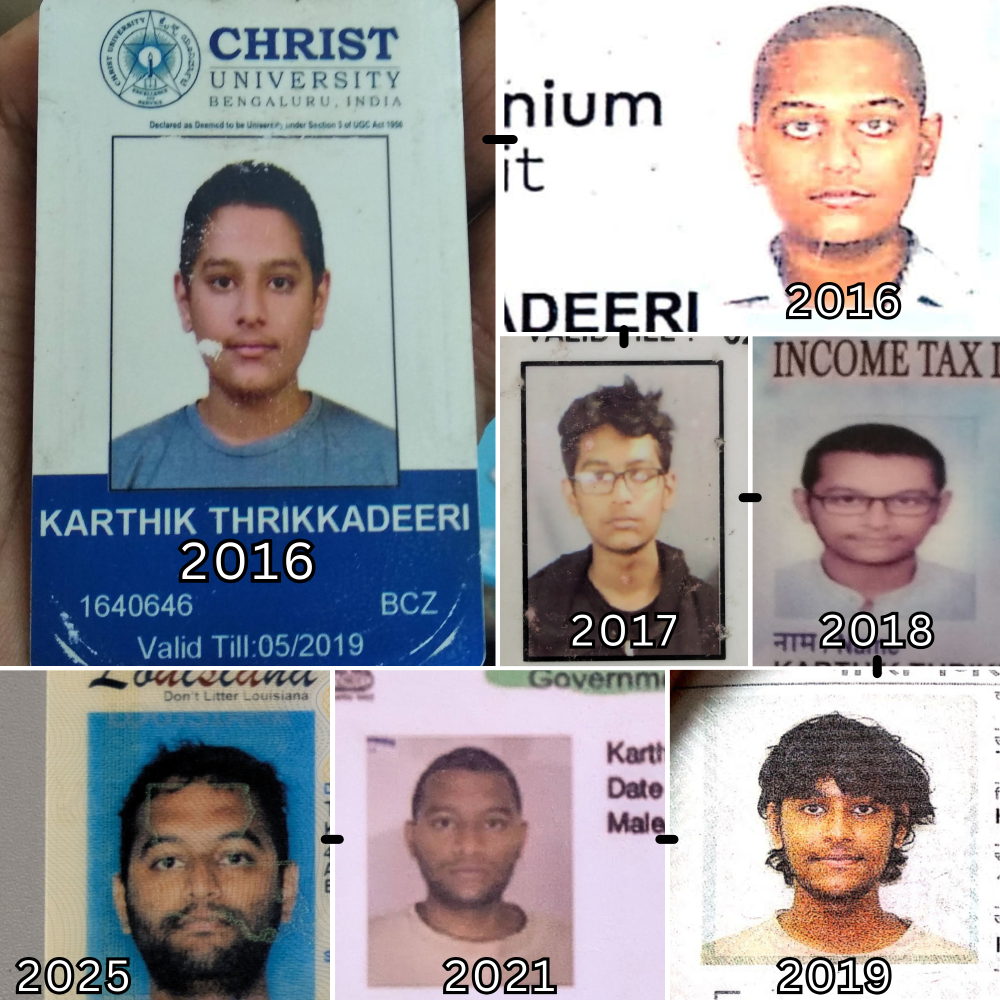
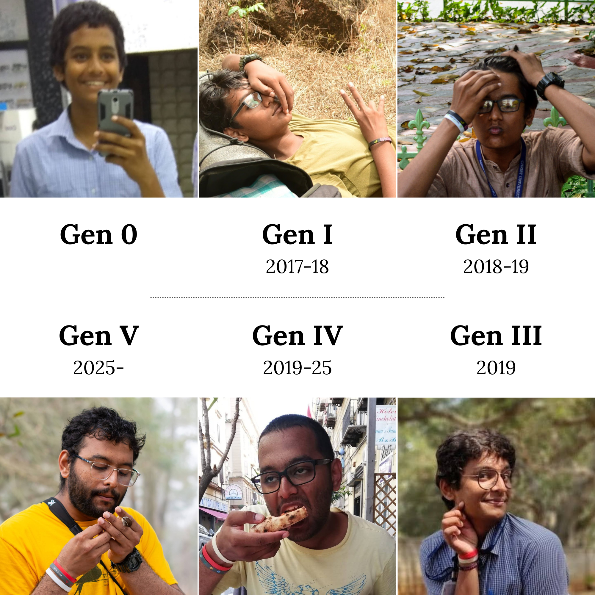

A decade ago, I started my undergrad which would go on to be one of the biggest inflection points of my life. There are innumerable things that have changed during this decade, and my noggin is two of them. I've long wished to collate all my avatars from those undergrad years defined in part by a crazy growth spurt. This wish is now fulfilled with this retrospective covering my post-undergrad chapters as well.

So here's a Janusian pocketbook, dedicated to that little kid, documentation which will hopefully suffice for defence against identity concerns.

## Mugshots: An executive summary

Deserving of Wanted posters, IMO.

## From the East Blue

A selection of my many avatars from the undergrad years.

## Timeskip

During my master's years in Czechia. Featuring the only ever true long-haired look in my life.

## Into the New World!

I enter the [New World 新世界](https://onepiece.fandom.com/wiki/New_World) of a full-time working adult. Later, I step foot in the real-world [New World](https://en.wikipedia.org/wiki/New_World) for the first time; [Laugh Tale](https://onepiece.fandom.com/wiki/Laugh_Tale) remains a mystery, but I first challenge the [Yonkō](https://onepiece.fandom.com/wiki/Four_Emperors) that is my PhD.

## A Roronoa story in wristbands

Over this decade, my [Santōryū 三刀流](https://onepiece.fandom.com/wiki/Three_Sword_Style) also matured, although it has less in common with Zoro's swords and more with his precious gold earrings. One by one, I procured worthy bands (until 三), then initiated a second phase which can accommodate decommissions and retirement, with simultaneous recruitment of new active units.

------------------------------------------------------------------------

> Y'all are hopeless, this is a decade of devotion  
> It's hard to stop my movement when I'm already in motion  
> This ain't luck, this is by design  
> I had to work in the dark for my light to shine
>
> --- Russ, "Sore Losers"
